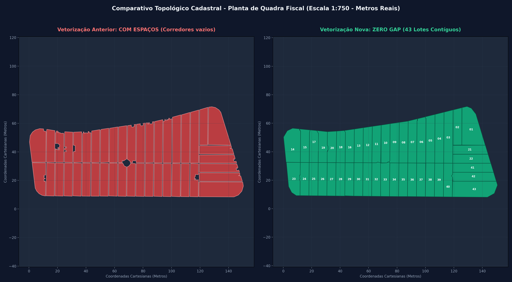

# 🗺️ Vetorizador de Quadras Fiscais

Aplicação Web e Motor GIS para leitura, processamento e vetorização automatizada de plantas cadastrais e fiscais em formatos raster (**PDF, TIF, JPG, PNG**) gerando geometrias métricas contínuas em **Shapefile (.shp), GeoPackage (.gpkg), KML (.kml) e GeoJSON**.



---

## 🚀 Como Iniciar a Aplicação

1. Dê um duplo clique no arquivo [`run_app.bat`](run_app.bat) ou execute:
   ```cmd
   run_app.bat
   ```
2. Abra seu navegador no endereço:
   👉 **`http://localhost:5055`**

---

## 🛠️ Principais Recursos e Diferenciais

1. **Topologia Cadastral Contínua (Zero Gap)**:
   - Utiliza **Tesselação Voronoi via Transformada de Distância Euclidiana** (`scipy.ndimage.distance_transform_edt`) restrita à quadra.
   - Cada lote semente se expande uniformemente até encontrar os lotes vizinhos no eixo central da linha divisória desenhada.
   - **Zero espaço vazio:** os lotes vizinhos compartilham a mesma aresta exata (sem frestas, sem sobreposições).
   - Eliminação automática de "mordidas" e furos causados por textos, cotas ("7.00") ou círculos de identificação ("(P)").

2. **Numeração Inteligente por Anel Cadastral**:
   - Ordena os lotes seguindo o padrão de loteamento fiscal municipal:
     - **Linha Superior:** Lotes 01 ao 20 (da esquerda para a direita).
     - **Lateral Direita:** Lotes 21 ao 25 (de cima para baixo).
     - **Linha Inferior:** Lotes 26 ao 43 (da direita para a esquerda).
   - **Edição Livre:** Possibilidade de renomear qualquer lote diretamente na tabela com sincronização instantânea no mapa e nos downloads.

3. **Cálculo Métrico Real e Calibração por Cota**:
   - Escalas nominais e calibradas (`1:750`, `1:835`, `1:1000`, ou livre).
   - **Calibrador por Cota Real:** Permite informar a testada padrão do lote (ex: `7.00 m`) para compensar automaticamente reduções de scanner/fotocópia.
   - Sistema de Coordenadas de Referência: **SIRGAS 2000 / UTM 23S (EPSG: 31983)**.

4. **Visualizador Interativo Web**:
   - Interface moderna (Tailwind CSS + Leaflet em `L.CRS.Simple`).
   - Sobreposição dos vetores diretamente sobre a prancha escaneada.
   - Controle de transparência, alternância de camadas e destaque de lote ao passar o mouse.
   - Rótulos visuais de cada lote e tabela de dados com áreas ($m²$) e perímetros ($m$).

5. **Exportação Multiformato (1 Clique)**:
   - 📦 **Shapefile (.zip)**: `quadra.shp`, `lotes.shp`, `.dbf`, `.shx`, `.prj` e `.cpg`.
   - 🗺️ **GeoPackage (.gpkg)**: Banco SQLite geoespacial padrão OGC.
   - 📄 **GeoJSON (.geojson)**: Para integração em Web GIS e bancos relacionais/PostGIS.
   - 🌐 **KML (.kml)**: Para visualização em 3D no Google Earth.

---

## 📁 Estrutura do Projeto

```
Vetorizador de quadras/
├── app/
│   ├── core/
│   │   ├── processor.py     # Motor de visão computacional, tesselamento Voronoi e cálculo métrico
│   │   └── exporter.py      # Exportador multiformato (SHP, GPKG, KML, GeoJSON)
│   ├── templates/
│   │   └── index.html       # Interface web interativa (Tailwind + Leaflet)
│   ├── storage/             # Armazenamento de uploads, cache e arquivos exportados
│   └── server.py            # Servidor Flask com endpoints REST
├── Exemplos de quadras/      # Amostras reais de plantas fiscais (.png, .jpg, .tif)
├── scripts/                 # Scripts utilitários e testes
├── comparativo_zero_gap.png # Gráfico comparativo de validação topológica
├── plot_zero_gap_detalhado.png # Mapa cadastral completo com áreas em m²
├── run_app.bat              # Inicializador rápido 1-clique
└── README.md
```

---

## 📋 Requisitos de Ambiente

- **QGIS 3.x LTR** (ou Python 3.10+ com GDAL, Shapely, GeoPandas, OpenCV, SciPy, Flask e PyPDFium2).
